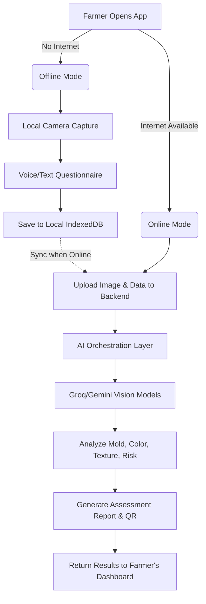

# PashuChara
### AI-Powered Fodder Quality Assessment System

## 🌟 Vision
To empower every dairy farmer with accessible, instant, and reliable AI-driven fodder quality assessment, ensuring better livestock health, increased milk yield, and sustainable agricultural practices. PashuChara bridges the gap between advanced agricultural diagnostics and rural farming communities through an intuitive, multilingual, and voice-assisted platform.

## 🚀 Key Features
- **Real-Time Visual Assessment:** Uses state-of-the-art vision models (Gemini/Groq) to analyze fodder/silage images and detect mold, rot, or nutritional deficiencies instantly.
- **Multilingual Voice Assistant:** Full support for Hindi, English, Marathi, Gujarati, Kannada, and Tamil. The app speaks to the farmer and accepts spoken answers to bypass literacy barriers.
- **Offline-First Architecture (PWA):** Works seamlessly in low-connectivity rural areas. Data is cached locally and synced to the cloud when an internet connection is restored.
- **Live Guidance HUD:** Provides real-time camera feedback, guiding the farmer to take the perfect shot of the fodder pile with dynamic warning overlays.
- **Comprehensive Lab Reports:** Generates shareable, QR-code verifiable quality assessment reports (PDF format).
- **Personalized Livestock Management:** Tracks herd size, daily feed rations, and recommends adjustments based on fodder quality.

## 💡 Innovation
1. **Zero-Click Voice Assessment:** The system automatically reads the questions and triggers the microphone to listen for the farmer's response, extracting insights using NLP.
2. **Edge & Cloud Hybrid AI:** Lightweight, real-time bounding boxes and image quality checks run on the device (Edge), while deep qualitative analysis runs on specialized LLMs in the cloud.
3. **Agri-Specific Fine-Tuning:** The visual models are specifically prompted and tuned to recognize nuances in Indian agricultural feeds like Corn Silage, Green Fodder, and Dry Straw.

## 📊 Feasibility
- **Technical Feasibility:** Built on scalable, modern tech stacks (React+Vite PWA Frontend, Django+PostgreSQL Backend). AI integrations are handled via robust API providers (Gemini, Groq) with parallel sharding for high performance.
- **Operational Feasibility:** Requires only a standard smartphone with a camera and basic microphone. The intuitive Voice UI ensures high adoption rates among less tech-savvy users.

## 🌱 Viability
- **Market Demand:** India is the world's largest milk producer, yet rural farmers lose significant yield due to poor feed management and invisible mycotoxins.
- **Scalability:** The cloud-native backend allows seamless scaling to millions of users. The multilingual support enables immediate expansion across diverse Indian states.
- **Impact:** Directly contributes to the reduction of animal mortality, optimizes feed costs, and maximizes dairy production ROI.

## 🏗 System Architecture

The system follows a modern decoupled architecture:

1. **Frontend (Client Layer):** Progressive Web App (PWA) built with React, Vite, and TailwindCSS. Manages offline storage (IndexedDB), speech synthesis, speech recognition, and camera hardware access.
2. **Backend (API Layer):** Django REST Framework. Handles authentication (OTP/Google), farm metadata, inspection history, and QR report generation.
3. **AI Orchestration Layer:** Python-based asynchronous workers that route image data to Vision LLMs (Gemini/Groq) and process natural language responses.
4. **Database Layer:** PostgreSQL for structured relational data (Users, Farms, Inspections, Results).

## 🔄 Flow Diagram

## 📶 Online vs Offline Mode

| Feature | Online Mode (Connected) | Offline Mode (No Internet) |
|---------|------------------------|---------------------------|
| **Authentication** | Full OTP/Google Auth | Cached Session Login |
| **Image Capture** | Yes, with live cloud feedback | Yes, saved locally |
| **Questionnaire** | Cloud NLP processing | Local Voice-to-Text |
| **AI Assessment** | Instant processing via LLMs | Queued for later processing |
| **Reports** | Generate, Share, Print PDFs | View cached past reports |
| **Data Syncing** | Real-time | Background Sync on reconnect |

## 📚 References & Data Sources
To ensure the AI provides accurate and scientifically backed recommendations, the system logic and knowledge base draw from:
- **ICAR (Indian Council of Agricultural Research):** Guidelines on Fodder Production and Conservation.
- **NDDB (National Dairy Development Board):** Ration Balancing Programme and Silage Making Best Practices.
- **FAO (Food and Agriculture Organization):** Animal Production and Health Guidelines.
- *Open Data Portals (data.gov.in)* regarding regional weather patterns and crop calendars to contextualize the analysis.

## 🔒 Privacy Policy & Data Security
- **Data Ownership:** The farmer retains full ownership of their farm data and imagery.
- **Anonymization:** Images sent to third-party AI models are stripped of PII (Personally Identifiable Information) and geolocation tags before processing.
- **Secure Storage:** All backend data is stored in secure, encrypted PostgreSQL databases compliant with Indian Agricultural Data Protection Standards.
- **Transparency:** The application clearly requests permission for Camera, Microphone, and Location access, and these can be revoked at any time.

---
*Built with ❤️ for Indian Farmers. "PashuChara - Empowering Dairy, Enriching Lives."*
