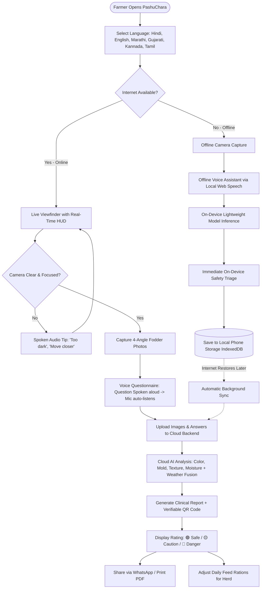
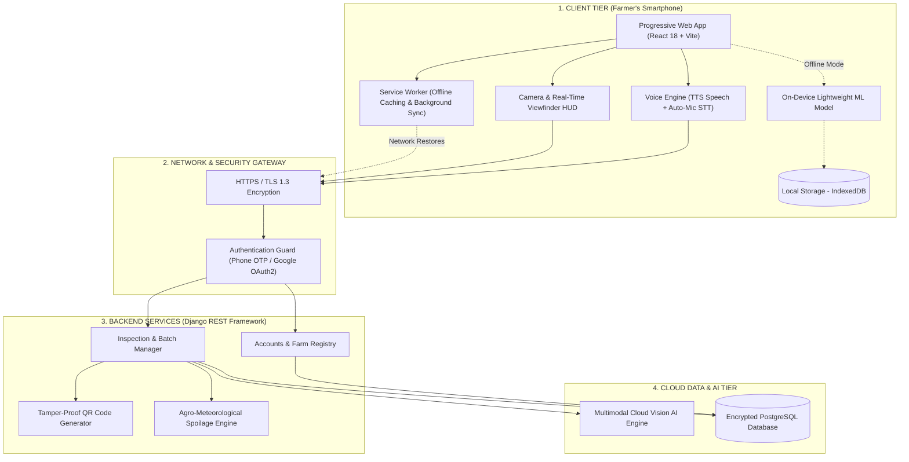

# 🐄 PashuChara (पशुचारा)
### Smart Rapid Feed & Silage Quality Testing System for Dairy Farmers

[-blue.svg)](#)

  
  
  
  
  
  
  
  

---

**Problem Statement ID:** SIH26111  
**Problem Statement Title:** Smart AI-Enabled Rapid Feed and Silage Quality Testing System for Dairy Farmers  
**Theme:** Agriculture, FoodTech & Rural Development  
**Category:** Software  
**Team ID:** 7687  
**Team Name:** Code4Cause  

---

## 📌 What is PashuChara?

**PashuChara** is an easy-to-use, voice-assisted mobile platform designed for Indian dairy farmers. It turns an ordinary smartphone into a personal fodder testing tool. 

Farmers simply point their phone camera at cattle feed or silage. The app speaks in their local language, inspects the quality instantly, and tells them if the feed is safe to give their cattle—all in under one minute. It works reliably even in remote village sheds without internet.

---

## 🛑 The Problems We Solved

Every day, millions of small dairy farmers face serious challenges with cattle feed:

1. **Slow and Expensive Lab Testing:** Sending a feed sample to an agricultural testing lab costs **₹1,500 or more** and takes **4 to 7 days** for results. Farmers cannot wait days or spend this much money on regular feed.
2. **Deadly Toxins & Lost Milk Yield:** When cattle eat moldy or poorly fermented feed, toxic substances (*Aflatoxins*) enter their system. This causes severe sickness, drops daily milk production by **15% to 25%**, and contaminates the milk sold to families.
3. **Language & Typing Barriers:** Most software requires farmers to type in English, read complicated charts, and fill long forms. Farmers working in barns have dirty hands and often cannot read or type on mobile screens.
4. **No Internet in Cattle Sheds:** Village cattle sheds and silage pits are often located in low-signal areas where regular apps stop working entirely.
5. **Weather-Driven Spoilage:** High humidity and summer heat accelerate mold growth inside silage pits, but farmers have no way to know until the entire batch is ruined.

---

## 🚀 How Each Feature Works & Why It Is Useful

### 1. 📷 Live Camera Guidance (Real-Time Viewfinder)
- **How It Works:** The farmer opens the app camera and points it at the feed pile. While looking through the screen, the app immediately checks if the picture is clear. If it is too dark, blurry, taken from too far, or if hands/feet are blocking the view, the app displays bright warning cards and speaks the instruction out loud (*"Move closer"*, *"Turn on flashlight"*).
- **Why It Is Useful:** Farmers do not need photography skills. They get perfect, clear pictures every time, ensuring accurate testing without repeated tries.

---

### 2. 🎙️ 100% Typeless Voice Assistant (Zero Typing Needed)
- **How It Works:** The app talks directly to the farmer in their native language (**Hindi, English, Marathi, Gujarati, Kannada, Tamil**). It reads out simple questions one by one (*"Does the feed smell sour or rotten?"*). The moment the question finishes, the phone microphone automatically turns on and listens. The farmer simply speaks their answer, and the app fills it in automatically.
- **Why It Is Useful:** The farmer never has to type a single letter. Even farmers who cannot read or write can complete a full assessment with their hands free while working in the shed.

---

### 3. 🧠 Instant Feed Quality Triage (Works Both Online & Offline)
- **How It Works:** The app examines the feed color, texture, moisture, and mold patterns. It immediately gives a clear, honest result using three simple color codes:
  - 🟢 **Safe (ठीक):** Feed is healthy and well-fermented. Safe for lactating animals.
  - 🟡 **Caution (ध्यान दें):** Early signs of mold or air exposure. Instructions provided on which parts to remove and how to treat the rest.
  - 🔴 **Danger (तुरंत बदलें):** Rotten or toxic feed. Warning to stop feeding immediately to prevent cattle poisoning.
- **Why It Is Useful:** Gives farmers instant clarity on what to do *before* cows eat dangerous feed. No waiting days for a lab report.

---

### 4. 📴 Complete Offline Dependability
- **How It Works:** When there is no internet connection in the cattle shed, the app keeps running normally. It saves photos on the phone, conducts the voice questionnaire, uses a built-in lightweight model on the phone to give an immediate assessment, and saves the record. As soon as the farmer enters an area with internet, the app automatically uploads the record to the cloud.
- **Why It Is Useful:** The app never freezes or shows "Network Error" in rural sheds. It works anywhere, anytime.

---

### 5. 📄 Verifiable Diagnostic Lab Report with QR Code
- **How It Works:** After every test, the app generates a digital diagnostic card. It lists observed smell, color, moisture level, safety rating, and clear daily action steps. Each report includes a scannable QR code.
- **Why It Is Useful:** 
  - Farmers can share reports with veterinarians or dairy cooperative supervisors via WhatsApp with one click.
  - Dairy collection centers and milk buyers can scan the QR code to verify feed safety and quality history.
  - Can be printed directly with clean, readable formatting.

---

### 6. ⛅ Weather & Moisture Spoilage Alerts
- **How It Works:** The app factors in local temperature and humidity. When weather conditions indicate high danger of fungal growth, it alerts the farmer in advance to check silage covering and moisture traps.
- **Why It Is Useful:** Prevents spoilage before it happens, protecting months of stored cattle feed from being ruined by sudden monsoon humidity or summer heat.

---

### 7. 🐄 Herd Profile & Daily Ration Balancing
- **How It Works:** Farmers save basic details about their cattle (number of cows/buffaloes, breeds like Gir, Murrah, Sahiwal, HF, Jersey, and average daily milk yield). Based on the tested feed quality, the app recommends how much dry fodder and green fodder to balance in daily rations.
- **Why It Is Useful:** Prevents feed wastage, balances animal diet, and helps farmers get the maximum possible milk production from their herd.

---

## 🔄 End-to-End Flow Diagram

---

## 🏗 System Architecture

---

## 💻 Tech Stack & Tooling

| Component | Technologies & Frameworks | Purpose in PashuChara |
| :--- | :--- | :--- |
| **Frontend Core** |   | Ultra-fast single-page responsive application |
| **Styling** |  | High-contrast, mobile-first design with large touch targets |
| **Voice & Audio** |  | Natural voice questions and hands-free spoken replies |
| **Offline Engine** |   | Zero-connectivity operation & background data sync |
| **Backend API** |   | Robust, secure REST endpoints and business logic |
| **Database** |  | Scalable, encrypted relational data store |
| **Cloud Hosting** |  | High-availability cloud deployment |

---

## 📶 Online vs. Offline: How It Works Everywhere

| Feature | When Connected (Online) | In Remote Sheds (Offline) |
| :--- | :--- | :--- |
| **Opening & Using the App** | Opens instantly | Opens instantly from phone cache |
| **Taking Pictures** | Camera with live feedback checks | Camera with built-in clarity checks |
| **Voice Questions** | App speaks and listens in chosen language | App speaks and listens in chosen language |
| **Testing Result** | Comprehensive cloud quality analysis | On-device safety triage |
| **Saving Data** | Saved immediately to cloud database | Saved securely on phone memory |
| **Syncing** | Real-time | Auto-syncs to cloud as soon as network returns |

---

## 📜 Standards & Scientific Guidelines We Follow

1. **ICAR-NDRI (National Dairy Research Institute) Benchmarks:** Follows official scientific guidelines for silage making, chop length, good fermentation colors, and mold thresholds.
2. **FSSAI (Food Safety and Standards Authority of India) Safety Limits:** Designed to prevent **Aflatoxin M1** contamination in milk, keeping milk safe for consumer health.
3. **NDDB (National Dairy Development Board) Guidelines:** Aligned with the **Ration Balancing Programme (RBP)** to recommend balanced dry matter intake for Indian cattle breeds.
4. **Farmer Privacy & Data Security:** No personal information or exact GPS coordinates are exposed. Farmers own all their feed and animal records.

---

## 💡 Real-World Value & Impact

- **Saves Money:** Replaces ₹1,500 lab tests with free, instant daily checks on the phone.
- **Protects Animal Lives:** Stops toxic feed from poisoning cows, preventing expensive veterinary treatments and livestock deaths.
- **Increases Milk Income:** Healthy feed prevents the 15% to 25% drop in milk production, directly increasing monthly dairy income.
- **Includes Every Farmer:** Voice in 6 regional languages means every farmer can use advanced technology, regardless of education or literacy.
- **Strengthens the Milk Chain:** Helps dairy cooperatives verify feed quality at collection centers, ensuring clean, toxin-free milk for everyone.

---

  <b>PashuChara (पशुचारा) - Empowering Dairy Farmers, Protecting Livestock, Enriching Lives.</b> 
  Team Code4Cause • Problem Statement SIH26111

